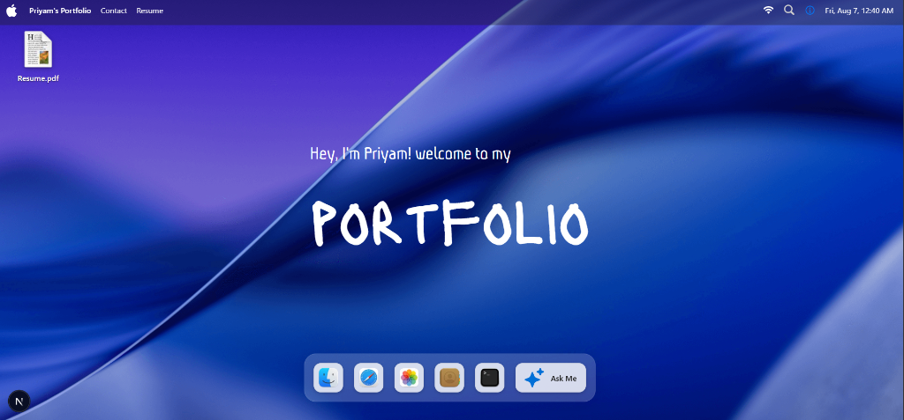

#  Priyam's macOS Portfolio

<div align="center">

  

  ### 🖥️ A sleek, interactive, macOS-inspired Desktop Portfolio Website built with Next.js, React 19, TypeScript, and Tailwind CSS.

  [Live Demo](https://portfolio-codewithpriyam.vercel.app/) · [Report Bug](https://github.com/Codewithpriyam/Portfolio/issues) · [Request Feature](https://github.com/Codewithpriyam/Portfolio/issues)

  [](https://nextjs.org/)
  [](https://react.dev/)
  [](https://www.typescriptlang.org/)
  [](https://tailwindcss.com/)
  [](https://vercel.com/)

</div>

---

## ✨ Features

-  **macOS Operating System Theme**: Authentic Apple MenuBar, Dock magnification effects, traffic light controls, draggable windows, and glassmorphism UI.
- 🤖 **Interactive AI Assistant (Ask AI)**: Powered by Groq LLM API. Responds in real-time to visitor queries about Priyam's skills, background, and contact details.
- 💻 **Interactive Terminal App**: Displays developer tech stack in a Unix-like terminal window (`@Priyam % show tech stack`).
- 🌐 **Mock Safari Browser App**: Fully interactive browser simulation with Google search, GitHub preview, and custom URL navigation.
- 🖼️ **Photos & Gallery App**: Interactive photo gallery window showcasing hackathon and tech event moments.
- 📑 **PDF Resume Viewer**: Instant access to Priyam's resume in a single click from the Desktop icon or MenuBar.
- 🔄 **Dynamic Project Mapping**: Projects added to the codebase automatically render both inside the Portfolio modal AND as draggable desktop shortcuts on the screen.
- 📱 **Fully Responsive Layout**: Mobile-optimized standalone portfolio experience for small screens.

---

## 🛠️ Tech Stack

- **Framework**: Next.js 16 (App Router + Turbopack)
- **Library**: React 19
- **Language**: TypeScript
- **Styling**: Tailwind CSS, CSS Modules
- **Interactivity**: `react-draggable`, GSAP animations
- **AI Integration**: Groq Cloud SDK (`llama-3.3-70b-versatile`)
- **Deployment**: Vercel

---

## 💻 Getting Started Locally

### Prerequisites

- Node.js `v18.0.0` or higher
- npm or yarn

### Installation

1. **Clone the repository**:
   ```bash
   git clone https://github.com/Codewithpriyam/Portfolio.git
   cd Portfolio
   ```

2. **Install dependencies**:
   ```bash
   npm install
   ```

3. **Configure Environment Variables**:
   Create a `.env.local` file in the root directory:
   ```env
   GROQ_API_KEY=your_groq_api_key_here
   ```

4. **Start local development server**:
   ```bash
   npm run dev
   ```

5. **Open Browser**:
   Visit [http://localhost:3000](http://localhost:3000) to view your local workspace.

---

## ⚙️ How to Update Content & Add Projects

Full step-by-step documentation is available in [`HOW_TO_UPDATE.md`](./HOW_TO_UPDATE.md).

### Adding a New Project:
Edit `components/Portfolio.tsx` and add your project to `export const PROJECTS`:

```typescript
export const PROJECTS: Project[] = [
  {
    id: 1,
    icon: "🌐",
    name: "My Live App",
    description: "Built a full stack platform with Spring Boot and React.",
    techs: ["Java", "Spring Boot", "React.js", "MySQL"],
    github: "https://github.com/Codewithpriyam/my-live-app",
    live: "https://myliveapp.com",
  }
];
```
> *The project will automatically render as a desktop shortcut icon on your main screen and inside the Portfolio window!*

---

## 🤝 Connect with Priyam Kumar

- **GitHub**: [@Codewithpriyam](https://github.com/Codewithpriyam)
- **LinkedIn**: [Priyam Kumar](https://www.linkedin.com/in/priyam-kumar-5057a123b/)
- **LeetCode**: [Hyperscout](https://leetcode.com/u/Hyperscout/)
- **Email**: Priyamsingh504@gmail.com
- **Phone**: +91 8873932040

---

<div align="center">
  <sub>Designed & Developed with ❤️ by <a href="https://github.com/Codewithpriyam">Priyam Kumar</a></sub>
</div>
